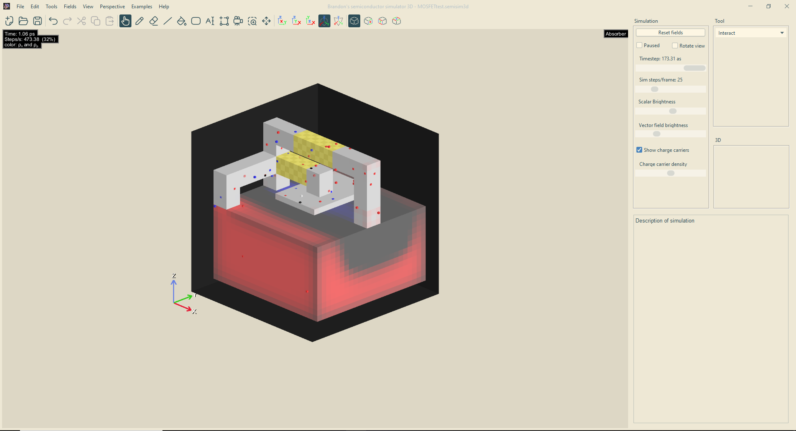
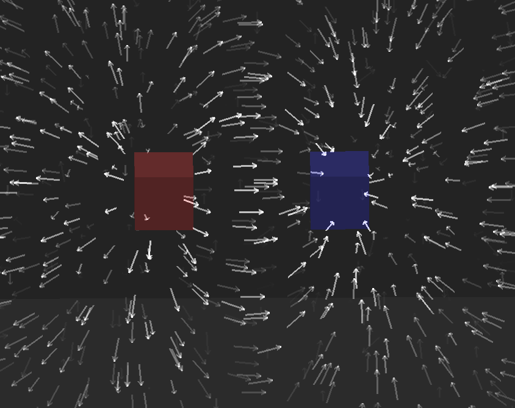
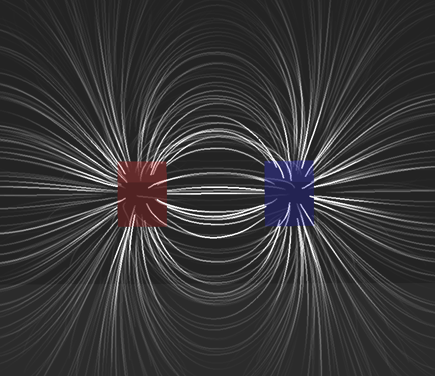
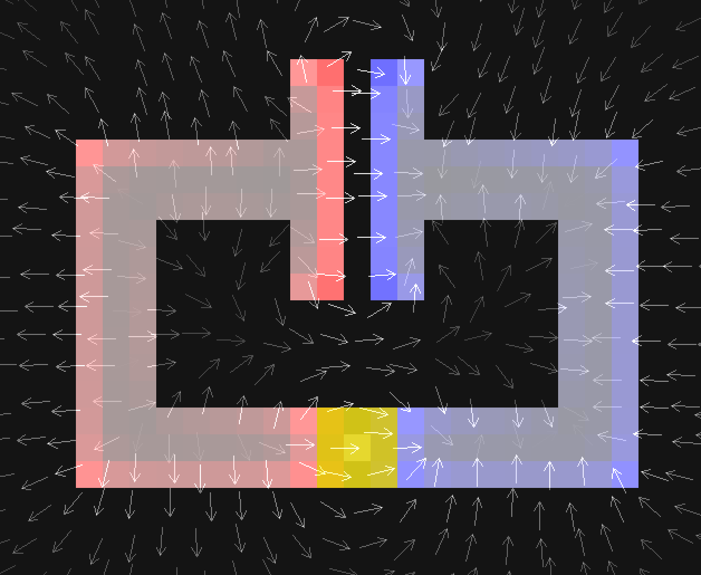
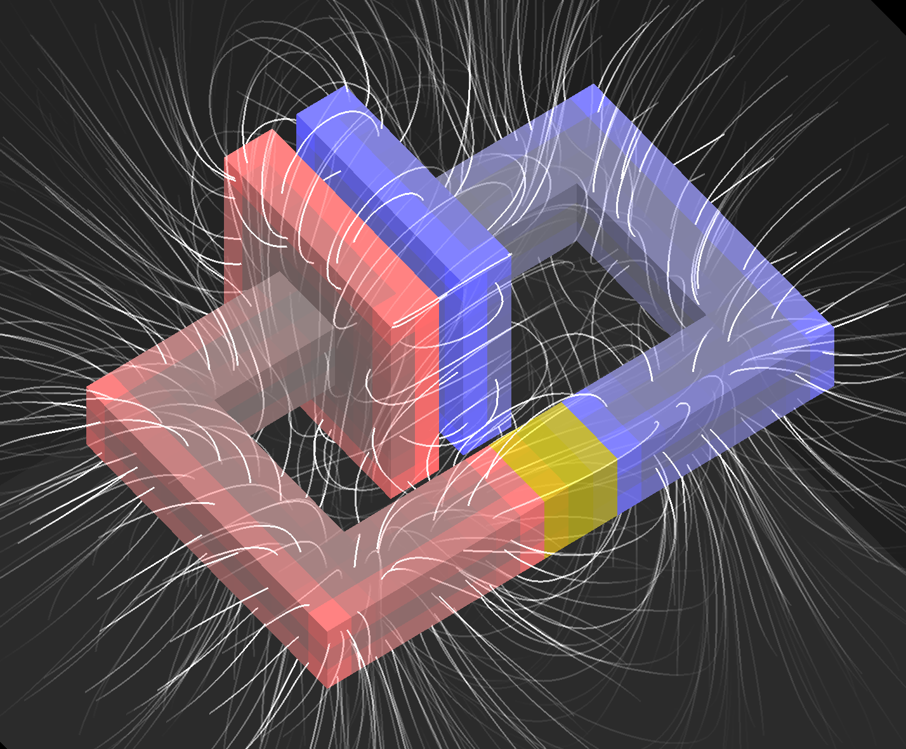
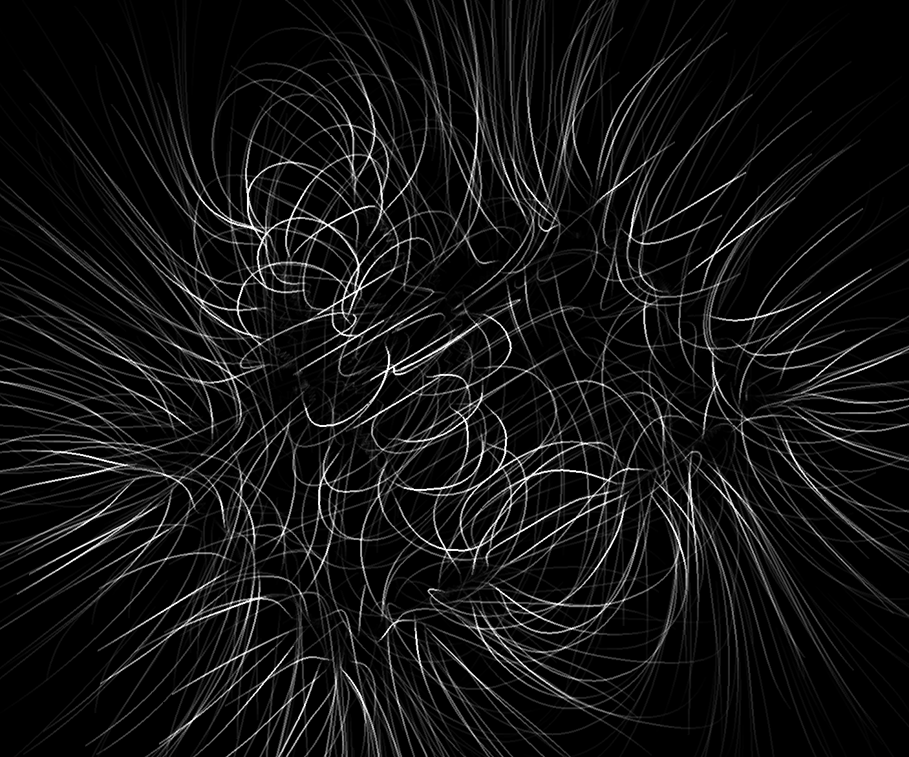
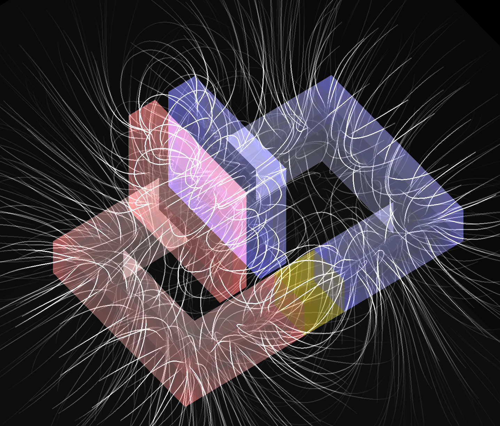
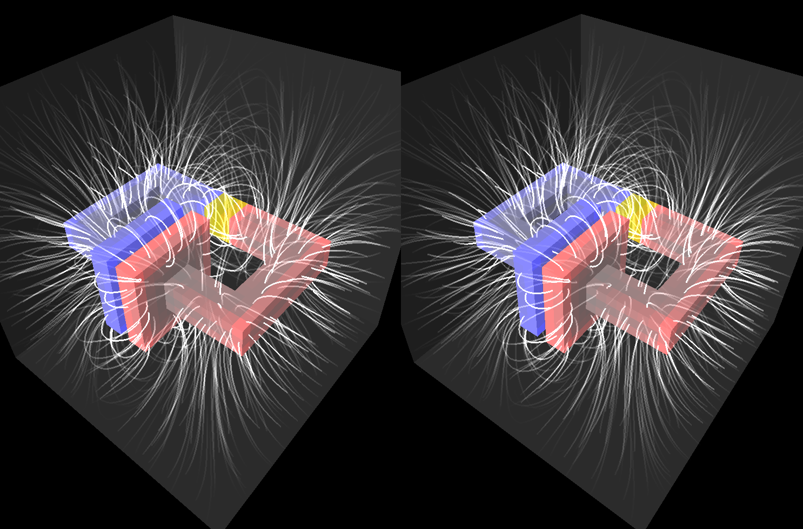

# Build instructions
Clone the repository using

```bash
git clone https://github.com/StunningLlama/SemiSim.git
```
Building requres Java 1.8 and Maven for dependency management.

## Eclipse
- Go to **File > Import > Existing Maven Projects**
- Select the cloned repository folder
- Click Finish

# Introduction

Brandon's electromagnetic simulation simulates simple circuits in three dimensions. Like [SemiSim](https://brandonli.net/semisim), it allows users to create their own circuits with a simple interface. There is a variety of materials to choose from and a variety of premade examples to look at.

## Physics

The simulation takes place on a three-dimensional cubic grid. It uses an FDTD method to compute the dynamics of the E and B fields. This simulation demonstrates the following concepts:

*   Electromagnetic fields
*   Charges
*   Current and voltage
*   Capacitance and inductance
*   Basic electrical circuits

# Simulation features

The interface consists of the simulation area which the user can interact with and the settings panel containing all the simulation controls.



Simulation area (left) and settings (right).

The main way to interact with circuits is to change the strength of voltage sources and turn switches on and off. The quickest way to get started is to load one of the examples and start changing the voltages.

## Vector view modes

**Arrows:** The direction and brightness of arrows corresponds to the direction and magnitude of the vector field.



**Lines:** The brightness and density of lines indicates the magnitude of the field.



## Rendering modes

|     |     |
| --- | --- |
| 2D x cross-section | Displays a cross-section in the y and z directions along a slice of constant x, controlled by the "Slice" slider. |
| 2D y cross-section | Displays a cross-section along a slice of constant y. |
| 2D z cross-section | Displays a cross-section along a slice of constant z.<br><br> |
| 3D orthographic | Displays an orthographic three-dimensional view of the scene (viewer infinitely far away).<br><br> |
| 3D orthographic (fields only) | Render only the field lines/vectors.<br><br> |
| 3D orthographic (transparent) | Makes solid objects semi-transparent.<br><br> |
| 3D perspective | Displays a persepective view of the scene (viewer at finite distance). |
| 3D perspective (fields only) | Render only the field lines/vectors. |
| 3D perspective (transparent) | Makes solid objects semi-transparent. |
| 3D stereoscopic (cross-eye) | Renders a binocular image that allows the viewer to see depth by [crossing their eyes.<br><br><br><br>](https://en.wikipedia.org/wiki/Stereoscopy) |
| 3D stereoscopic (parallel) | Left and right eyes are flipped with respect to cross-eye. |

## Options

|     |     |
| --- | --- |
| Pause | Pauses and unpauses the simulation. |
| Show detailed info | Displays a tooltip that contains the values of all the simulation variables at the cursor's location. |
| Show text background | Gives text boxes a black background, making the text easier to see. |
| Display interface | Shows probe info, graph locations, time, and tooltip. |
| Boundary condition | Choose between a boundary that absorbs outgoing radiation or a perfectly conductive boundary that reflects it. |
| Scalar view | Choose which field to display as a color scale over the simulation field. |
| Vector view | Choose which vector field to visualize (only works for 2D vectors, see "Vector view modes"). |
| 3D mode | Choose between different two and three-dimensional persectives. |
| Show material colors | If checked, gives each material a different color, making them easier to tell apart. |
| Timestep | Sets the simulation timestep. The maximum timestep is determined by the CFL condition for the wave equation and diffusion equations for each charge carrier. |
| Sim steps/frame | Sets the number of iterations performed during each frame. Most of the examples require at least 10 steps/frame to run responsively. The maximum number depends on how good the user's computer is. |
| Scalar brightness | Sets the brightness of the scalar field. |
| Vector brightness | Sets the brightness of the vector field. |
| Parallax | Determines the angle between the two eyes in stereoscopic mode (adjust for comfort). |
| Save scenario | Saves the current simulation to a file. |
| Load scenario | Loads a simulation from a file. SemiSim comes with a variety of pre-made simulations located in the "examples" folder. |
| Clear all | Removes all materials and resets all fields. |
| Set fields to zero | Sets all fields to their default values, leaving the materials unchanged. |
| Rotate view | Makes the 3D scene spin around. |
| Tool | Selects one of the tools. |

## Tools

|     |     |
| --- | --- |
| Interact | Allows user to control voltage sources and turn switches on and off by clicking. |
| Draw | Adds material to the field. |
| Voltage | Adds a voltage probe that measures electrochemical potential at a certain point (See "What do voltmeters actually measure"). |
| Current  <br>\[click and drag\] | Adds a current probe that measures current across a wire. |
| Ground | Specifies the point relative to which probes measure voltage (optional). |
| Delete probe | Click to delete a probe. |
| Replace | Similar to the draw tool, but overwrites occupied areas. |
| Line  <br>\[click and drag\] | Draws a line of material. |
| Fill | Fills a region with a certain material, similar to the bucket tool. |
| Erase | Erases material. |
| Select | Makes a rectangular selection which can be dragged around and moved. |
| Select region | Selects a contiguous region, similar to the bucket tool. |

## Keyboard/Mouse Controls

|     |     |
| --- | --- |
| P or Space | Pause & unpause |
| F   | Advance frame |
| Q   | Change brush shape |
| C   | Toggle material color |
| V   | Toggle vectors |
| S   | Toggle scalar colors |
| T   | Toggle tooltip |
| G   | Toggle text background |
| H   | Toggle user interface |
| Mouse wheel | Change brush size |
| Shift | Draw straight lines |
| Ctrl | Fill area |
| Alt or Option | Pick material |
| Ctrl-X | Cut |
| Ctrl-C | Copy |
| Ctrl-V | Paste |
| Left mouse | Draw material |
| Right mouse | Erase material |
| Middle mouse | Pick material |

## Materials

|     |     |
| --- | --- |
| Voltage source | Generates a voltage that can be used to power circuits. |
| Switch | Conductivity can be switched on and off by the user. |
| Metal | Material that conducts electricity very well. |
| Conductive metal | More conductive than regular metal. |
| Resistive metal | Less conductive than regular metal. |
| Dielectric | Material with a large permittivity/dielectric constant. |
| Ferromagnet | Magnetic material with high relative permeability. |
| Positive static charge | Positively charged insulating material. |
| Negative static charge | Negatively charged insulating material. |
| Decoration | Used for text or circuit symbols, has no effect otherwise. |
| Vacuum | Empty space. |

# Miscellaneous questions and answers

## What do the colors mean?

In general, the color red is associated with either holes or a positive charge. Blue represents electrons or negative charge. White means both electrons and holes exist a location. In the rest of the cases, yellow represents a positve quantity (eg. chemical potential or magnetic field), while cyan is negative. Finally, green is used for quantites that are always positive (eg. energy density). Note: Each material also has its own color which is unrelated to the aforementioned color scheme.

## What do voltmeters actually measure?

You might notice that the reading from a voltage probe doesn't match the electric potential Φ. In reality, voltmeters do not measure Φ but rather differences in electrochemical potential of charge carriers. Things get a bit trickier when we ask what the voltage is in a piece of semiconductor, becuase now there are multiple charge carriers! In this case we can try to define voltage as the reading we get when we stick a small metallic probe at a certain point. This can actually be performed in the simulation, and the result is that the electrochemical potential of the metal lies between that of electrons and holes, closer to whichever one has a larger density. I approximate this with a simple weighted average, the result of which is displayed on the voltage probe.

Copyright (c) 2025 Brandon Li  
[brandonli.lex@gmail.com](mailto:brandonli.lex@gmail.com)
